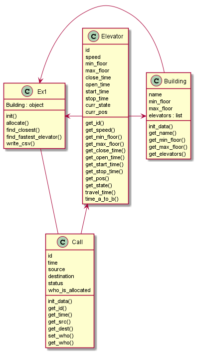

# **Smart Elevators - Assignment 1**

> Made by Yuval Bubnovsky & Itamar Kraitman

>Githubs:
> > Yuval Bubnovsky : https://github.com/YuvalBubnovsky
> 
> >Itamar Kraitman: https://github.com/itamarKraitman

### **Introduction**

This repository is part of an assigment in an object oriented programming course at Ariel University,
Specifically, this assigment is an implementation of an Offline algorithm - given a set of calls it looks to find the "best possible way" to allocate elevators accordingly.
The programming language used is Python.

## **Defining the problem space:**

In a multi-storied building, people use elevators to travel between floors, the problem is to to find "the best way" to allocate these elevators in respect to the calls.
* There are 'N' floors in a building
* There may be one or more elevators
* Each request enters at a particular time and consists of a source floor & destination floor
* We need to determine the "best way" to allocate said elevators

## **Our Offline algorithm:**

Before we start discussing our algorithm, we need to define what is the "best way" to allocate calls - we chose to gauge our efficiency by examining how long did it take us to answer all calls, we define "best" as having the lowest amount of total time it took the algorithm to handle all calls.  
Our algorithm employs FCFS (First Come - First Serve), which means calls get processed as they arrive and there are no calls waiting to be allocated.  
The algorithm is:
1) Compute how many calls in the input are upward or downward.
2) Assign elevators accordingly ( if there are more upward calls then downward ones - there will be more elevators assigned to these type of calls )
3) As a call enters, check to see if there are any free elevators with no calls assigned - if so, allocate the call to the free elevator.
4) If no free elevators are available - check if the call is an UP/DOWN call and look for elevators who can potentially pick up the call "on the way" without having to change direction.
5) Check which of the potential elevators will have the least amount of time delay if they are assigned this new call, also, pick the closest elevator.
6) Assign the call accordingly.

## **Code Implementation:**

The code is designed in an OOP approach, with Ex1.py being the main program, supported by Elevator, Building and Calls class.
We recieve a JSON and CSV file as user input and construct all objects using data from these files - once the algorithm finishes, we write back to a CSV file which elevator is allocated to each call.

## **Testing:**

Test classes are included in the repository.

## **UML Diagram:**



## **Executing The Project:**
Run the Ex1.py file in a directory containing all classes,  relevant Building json and csv with calls.  <br>
Use the following code template to run Ex1:  <br>
the simultor jar file is present at this repository.
```
python Ex1.py <Building json> <Calls csv> <output name>
```

* The csv with the results (same calls but allocated to elevators) will be created in the directory.   <br>
* you might need to use python3 instead when running on your local machine.

Running the algorithm example:
```
python Ex1.py B1.json C2.csv out.csv
```
Running the test code example:
```
java -jar Ex1_checker_V1.2_obf.jar 1111,2222,3333 B2.json Ex1_Calls_case_2_b.csv out.log
```

## **External info:**

While researching for this assignment, we used the following resources to understand the problem-space better and to realize our algorithm for the problem:
* [Wikipedia page regarding the elevator algorithm][wiki]
* [Work paper looking into optimization of online elevator algorithms][paper]
* [A video showcasing the elevator problem with possible solutions][youtube]
* [Github Scala project implementing a FCFS approach to the elevator problem][github]


[paper]: https://citeseerx.ist.psu.edu/viewdoc/download?doi=10.1.1.62.1185&rep=rep1&type=pdf
[wiki]: https://en.wikipedia.org/wiki/Elevator_algorithm
[youtube]: https://www.youtube.com/watch?v=xOayymoIl8U
[github]: https://github.com/sitano/mesosphere-elevator
